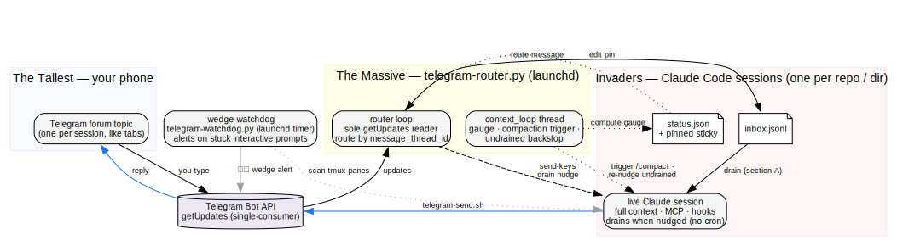
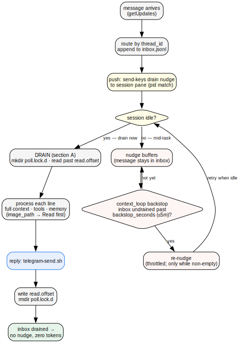
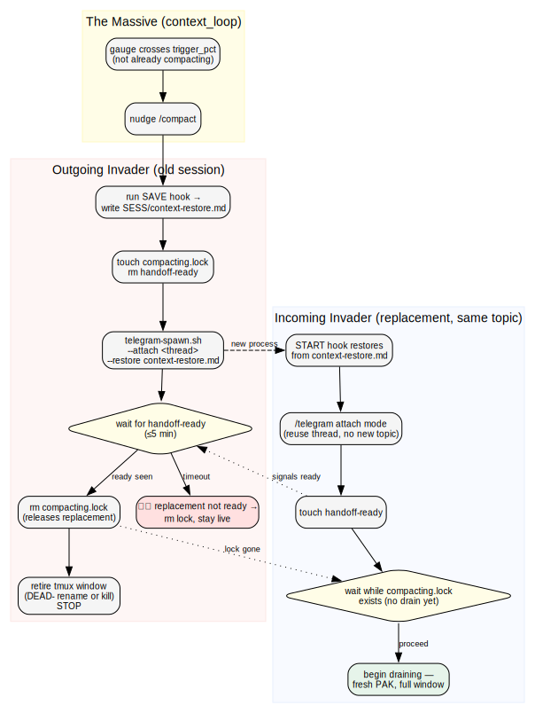
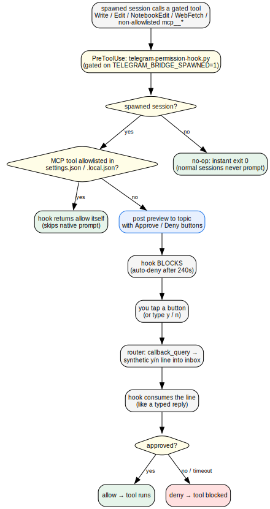

# Architecture

How `incoming-transmission` moves a message between your phone and a live Claude
Code session, and how it keeps that session healthy over a long conversation.

The design is **smart router, dumb session**: one daemon (the Massive) owns all
timing — routing, push delivery, the context gauge, and compaction triggering — and
each session is a purely reactive processor that drains its inbox when nudged. The
session runs no cron and schedules nothing.

The diagrams below are graphviz sources in [`diagrams/`](diagrams/), rendered to SVG
with `make diagrams` (requires [graphviz](https://graphviz.org/)). The Zim
vocabulary (the Massive, Invader, the Tallest, transmission, PAK) matches the
[README](../README.md#the-vocabulary).

## System topology

The pieces and who talks to whom: your phone's forum topic, the router daemon that
is the only process allowed to read Telegram, the sessions it routes to, and the
out-of-band watchdog.



<!-- Source: diagrams/system-architecture.dot — regenerate with `make diagrams` -->

- **The Massive** (`telegram-router.py`, launchd) is the sole `getUpdates` reader —
  Telegram's long-poll is single-consumer, so exactly one process owns it. It routes
  each message by `message_thread_id` into that session's `inbox.jsonl`, then pushes
  the session a drain nudge. Its `context_loop` thread computes each gauge, triggers
  compaction, and re-nudges undrained inboxes — all off the `getUpdates` path so a
  slow transcript scan can't stall routing.
- **An Invader** is a live Claude Code session bound to one topic. It keeps full
  context, MCP, and hooks, and only acts when nudged.
- **The wedge watchdog** (`telegram-watchdog.py`, a separate launchd timer) is the
  safety net for a session stuck on an interactive prompt nobody can answer — the
  one failure push delivery can't catch, because a wedged session never goes idle.

## Message lifecycle

One transmission from tap to reply. Push delivery is the primary path; the backstop
is what makes a missed push self-correct without the session polling.



<!-- Source: diagrams/message-lifecycle.dot — regenerate with `make diagrams` -->

The nudge is a drain **imperative only** — it never carries the message payload,
which always travels via the inbox, so a nudge can't be mistaken for task content.
If the session is mid-task when the keys arrive, the nudge buffers and the message
waits in the inbox (running work is never interrupted). The router's `context_loop`
notices the inbox is still undrained and re-nudges, throttled to `backstop_seconds`
(default 5m) and only while the inbox is non-empty — so an idle, drained session
costs zero tokens. Worst-case latency for a *missed* push is one backstop interval;
a delivered push drains immediately.

A per-topic `mkdir` lock (`poll.lock.d`) keeps a push drain and a backstop re-nudge
from double-replying; a stale lock (a drain that died before releasing) self-heals
past its TTL.

## Compaction handoff (PAK transfer)

A live process can't shrink its own context, so a filling session rolls over to a
fresh replacement in the **same topic**. The router detects the trigger; the session
does the handoff.



<!-- Source: diagrams/compaction-handoff.dot — regenerate with `make diagrams` -->

When the gauge crosses `trigger_pct` the router nudges `/compact`. The old session
saves its working state via the **save lifecycle hook** (which must leave a handoff
at `SESS/context-restore.md`), then spawns a replacement in attach mode pointed at
the same thread. The replacement restores from that file via its **start hook**,
attaches, and signals `handoff-ready`. The `compacting.lock` / `handoff-ready`
handshake guarantees the two sessions never drain at the same time and no message is
dropped or double-answered across the cutover. The save/restore mechanism is
pluggable — see [Customizing agent behavior](../README.md#customizing-agent-behavior).
Claude Code's native auto-compact remains the ultimate backstop if the router's
detection is ever down.

## Tier-2 permission approval

Optional, and only for unattended `/new` spawns running `spawned_mode: "ask"`. An
unattended session can't show a local permission prompt — it would hang the detached
pane — so the decision goes to your phone as tappable buttons.



<!-- Source: diagrams/permission-approval.dot — regenerate with `make diagrams` -->

`telegram-permission-hook.py` is a PreToolUse hook gated on
`TELEGRAM_BRIDGE_SPAWNED=1`, so it's an instant no-op for every normal session. For
a spawned session it routes `Write` / `Edit` / `NotebookEdit` / `WebFetch` and any
non-allowlisted `mcp__*` tool to the topic with Approve / Deny buttons, blocking
until you answer (auto-deny after 240s). MCP tools already on your
`settings.json` / `settings.local.json` allowlist are allowed by the hook directly
(no round-trip); a tapped button is delivered by the router as a synthetic `y`/`n`
line into the inbox, which the blocked hook consumes exactly like a typed reply.

> The shipped default is `spawned_mode: "auto-allow"` (fully autonomous, no approval
> round-trip). The tap-to-approve flow above only happens when you set
> `spawned_mode: "ask"`. See [Known issues](../README.md#known-issues).

## Regenerating the diagrams

```bash
make diagrams   # renders docs/diagrams/*.dot → *.svg
```

Edit the `.dot` source, re-run `make diagrams`, and commit both the `.dot` and the
regenerated `.svg`.
